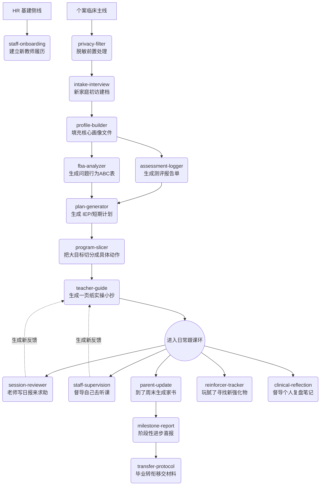

# 🧠 ABA Clinical Agent: 17 核大模型临床技能手册

本系统内置 17 个专为 BCBA 督导与特教机构设计的自动化技能（Skills）。
当你在大模型输入框中提到**触发词**或遇到对应场景时，Agent 将自动调用对应的技能，读取指定的知识库，并执行规范化的多文件写入。

为了让你更好地驾驭这个"数字前台"，以下是全套技能的工作流与功能详解：

---

## 🌊 核心工作流大局观 (The Pipeline)

整个系统分为两条主线："临床主线"与"HR基建侧线"。你可以顺着时间轴使用：

---

## 🛠️ 17 大技能详细分说

### 第一部分：人事与入组基建 (HR & Onboarding)
| 技能名 (Skill) | 触发暗号 | 它能帮你干什么？ |
| :--- | :--- | :--- |
| **`privacy-filter`** | "帮我把这段脱敏" | 接收带真名的评估表/原始笔记，过滤成代号（如 Client-A-兜兜），防止泄露。 |
| **`intake-interview`** | "接了个新孩子/初访" | 创建 `01-Clients` 夹子，榨取初访记录里的"家庭泛化能力"和"雷区"，生成骨架档案。 |
| **`profile-builder`** | "完善核心档案" | 基于前期的各路碎片，拼凑出一份极致结构化的核心 Master File。 |
| **`staff-onboarding`** | "来了个新老师小李" | 建立 `03-Staff/老师-小李` 文件夹，生成包含"强项/短板/踩坑区"的初始职业成长期基线。 |

### 第二部分：评估与方案制定 (Assessment & Planning)
| 技能名 (Skill) | 触发暗号 | 它能帮你干什么？ |
| :--- | :--- | :--- |
| **`assessment-logger`** | "刚做完 VB-MAPP" | 读取测试散点数据，对接内部的专业域字典，生成表格化《能力评估报告》。 |
| **`fba-analyzer`** | "这孩子最近老尖叫" | 读取 ABC 数据流，推导行为核心功能，给出统一的"绝对不能做的红线动作"。 |
| **`plan-generator`** | "生成IEP/写下阶段方案" | 阅读评估单和 FBA 红线，写明（LT/ST）及配套的教学范式（DTT/NET）。 |
| **`program-slicer`** | "怎么教穿鞋/拆解切片" | 将大目标切烂，对接内置《辅助层级字典》，给出从"全物理→独立"退场的明确梯队。 |

### 第三部分：日常磨课与迭代 (Session Review & Iteration)
*(注意：这里有 3 个最容易混淆的实操生成场景！)*
| 技能名 (Skill) | 触发暗号 | 它能帮你干什么？ |
| :--- | :--- | :--- |
| **`teacher-guide`** | "给小李写下节课的实操单" | **基于静止文档**：根据 IEP 和孩子的核心雷区，提炼一页只有干货的"战前外挂/小抄"，发给老师。 |
| **`staff-supervision`** | "我刚看了小李上课" | **督导视角输入**：记录督导自己的随笔，生成情感价值反馈，并静默**追加到小李的成长档案**中去。 |
| **`session-reviewer`** | "小李交了今天的课后记录" | **老师视角输入**：阅读老师交上来的表格卡片，给予肯定、给出"每日外挂"，同样追加更新小李档案。 |
| **`reinforcer-tracker`** | "找找新强化物" | 当孩子玩腻了当前玩具，重新排摸近期的偏好流，划分出"杀手锏"、"储备"与"待测试"。 |

### 第四部分：汇报、沟通与移交 (Comms & Transfer)
| 技能名 (Skill) | 触发暗号 | 它能帮你干什么？ |
| :--- | :--- | :--- |
| **`quick-summary`** | "马上开战前短会" | 5秒钟看遍全库（IEP进度、强化物、死穴），甩出一张供你快速回忆的摘要名片。 |
| **`parent-update`** | "写家书/小作文" | 读取上周答应过家长的事、本周的进阶点，写一封兼顾情绪支撑与大白话行为学原理的周报！ |
| **`clinical-reflection`** | "写复盘日记" | 沉淀个人督导经验法则，静默**追加到 `04-Supervision/灵感库`**，甚至生出机构培训用的 SOP 草案。 |
| **`milestone-report`** | "出喜报/结业" | 从起点测算变化，用感性文字包裹冰冷数据。 |
| **`transfer-protocol`** | "移交档案" | 当个案转向校园影子老师（Shadow T）或其它机构时，榨取最重要的指令控制法和医疗禁忌，输出移交书。 |

---
> 💡 打铁秘诀：你永远不需要死记硬背它们的名字。\n当你面对终端时只要说："兜兜的玩具都玩腻了，你看着办吧"，大模型会自动路由挂载 `reinforcer-tracker` 这个动作！
